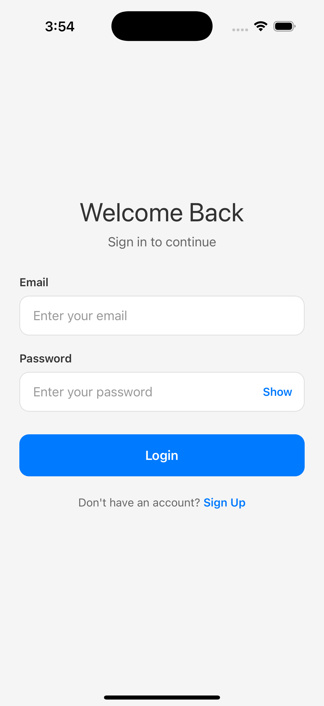
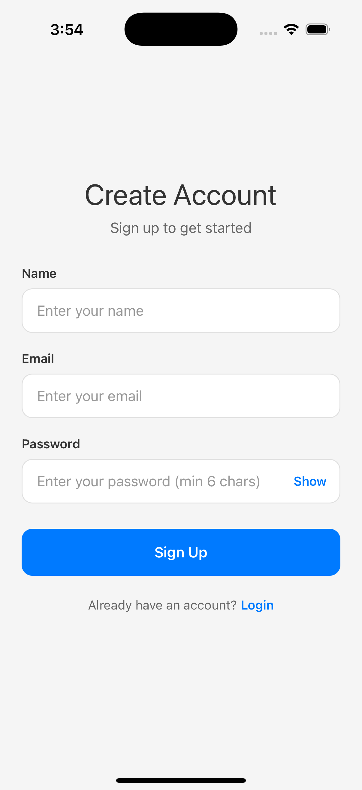
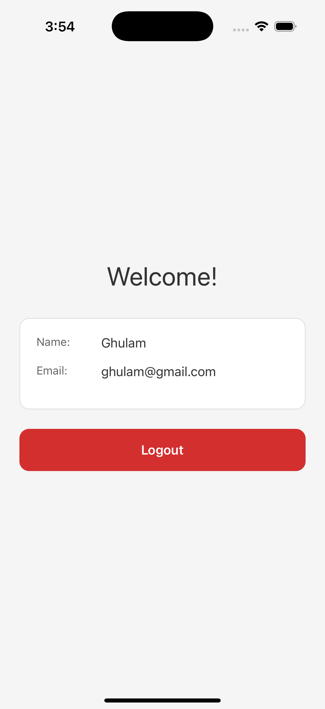

# React Native Authentication App 🚀

Hey there! 👋 

This is a complete React Native authentication app that I built to demonstrate a full auth flow using React Context API and AsyncStorage. Think of it as a simple, clean way to handle user authentication in your mobile app.

## What's This About?

So you know how every app needs users to sign up and log in? Well, this app does exactly that - but in a really clean, maintainable way. No complicated state management libraries, no over-engineered solutions. Just React Context, AsyncStorage, and some good old-fashioned React hooks.

## What Can You Do With This App?

### 🔐 Sign Up
Create a new account with your name, email, and password. The app stores all registered users in AsyncStorage, so you can come back later and log in with the same credentials.

### 🔑 Log In
Already have an account? Just enter your email and password. The app checks if you're registered and lets you in if everything matches.

### 🏠 Home Screen
Once you're logged in, you'll see a nice welcome screen with your name and email displayed. There's also a logout button if you want to sign out.

### 💾 Persistent Sessions
The cool part? If you close the app and come back later, you'll still be logged in! The app remembers your session using AsyncStorage.

## Screenshots

Here's what the app looks like:

### Login Screen

*Clean and simple login interface with email and password fields. The password field has a "Show" toggle so you can see what you're typing.*

### Signup Screen

*The signup screen where new users can create an account. It asks for name, email, and password (minimum 6 characters).*

### Home Screen

*After successful login, you'll see your name and email displayed in a nice card, along with a logout button.*

## How It Works

### The Flow

1. **First Time?** 
   - Open the app → You'll see the Login screen
   - Tap "Sign Up" → Fill in your details → Tap "Sign Up" button
   - You'll be redirected to the Login screen (no auto-login)
   - Enter your credentials → Tap "Login"
   - Welcome to your Home screen! 🎉

2. **Coming Back?**
   - If you're already logged in, you'll go straight to Home
   - If you logged out, you'll see the Login screen again

3. **Want to Log Out?**
   - Just tap the red "Logout" button on the Home screen
   - You'll be taken back to the Login screen

### Under the Hood

**Storage:**
- All registered users are stored in AsyncStorage under `@users`
- Your current session is stored under `@user` (without your password, of course!)
- When you log out, only the current session is cleared - your account stays registered

**Authentication:**
- Signup adds you to the users list
- Login checks if you exist in that list and verifies your password
- Passwords are stored as-is (in production, you'd hash them!)

**Navigation:**
- Uses React Navigation Native Stack
- Automatically shows Login/Signup if you're not logged in
- Shows Home if you are logged in
- Smooth transitions between screens

## Tech Stack

- **React Native** - The framework
- **React Context API** - For global auth state
- **AsyncStorage** - For persistent storage
- **React Navigation** - For screen navigation
- **React Hooks** - For all the state management

## Project Structure

```
auth_app/
├── src/
│   ├── components/          # Reusable UI components
│   │   ├── AppButton.js     # Button component
│   │   ├── AppTextInput.js  # Text input with password toggle
│   │   ├── AppText.js       # Typography component
│   │   ├── ErrorBanner.js   # Error message display
│   │   └── index.js         # Component exports
│   ├── context/
│   │   └── AuthContext.js   # Auth state & logic
│   ├── navigation/
│   │   └── AppNavigator.js  # Navigation setup
│   ├── screens/
│   │   ├── LoginScreen.js   # Login UI
│   │   ├── SignupScreen.js  # Signup UI
│   │   └── HomeScreen.js    # Home UI
│   └── utils/
│       └── validation.js    # Form validation helpers
├── App.js                   # Main app component
└── README.md               # This file!
```

## Getting Started

### Prerequisites

Make sure you have:
- Node.js (>= 18)
- React Native CLI installed
- iOS Simulator (Mac) or Android Emulator
- Xcode (for iOS) or Android Studio (for Android)

### Installation

1. **Clone or download this project**

2. **Install dependencies**
   ```bash
   npm install
   ```

3. **iOS Setup** (if you're on Mac and want to run iOS)
   ```bash
   cd ios
   pod install
   cd ..
   ```

4. **Run the app**
   
   For iOS:
   ```bash
   npm run ios
   ```
   
   For Android:
   ```bash
   npm run android
   ```

That's it! The app should launch on your simulator/emulator.

## Features Breakdown

### ✅ What's Included

- **Complete Auth Flow** - Signup, login, logout
- **Form Validation** - Real-time error messages
- **Password Visibility Toggle** - Show/hide password
- **Persistent Storage** - Users and sessions survive app restarts
- **Protected Routes** - Can't access Home without logging in
- **Loading States** - Buttons show loading indicators
- **Error Handling** - User-friendly error messages
- **Clean UI** - Modern, rounded inputs and consistent spacing
- **Reusable Components** - Button, TextInput, Text components

### 🎨 UI Components

- **AppButton** - Primary, secondary, and danger variants
- **AppTextInput** - With optional password toggle
- **AppText** - Typography with variants (h1, h2, body, etc.)
- **ErrorBanner** - For displaying error messages

## How to Use

### Creating an Account

1. Open the app
2. Tap "Sign Up" at the bottom
3. Enter your name, email, and password (min 6 characters)
4. Tap "Sign Up"
5. You'll be taken to the Login screen
6. Enter your email and password
7. Tap "Login"
8. Welcome! You're now on the Home screen

### Logging In

1. Enter your registered email and password
2. Tap "Login"
3. If credentials are correct, you'll see the Home screen

### Logging Out

1. On the Home screen, tap the red "Logout" button
2. You'll be taken back to the Login screen

**Built with ❤️ using React Native**
